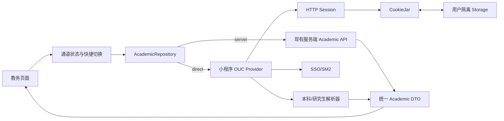

# Campus Miniapp: 教务查询小程序直连与双通道

**Priority:** High
**Status:** In Progress
**Type:** Feature
**Created:** 2026-07-30
**Last Updated:** 2026-07-30

## 概述

在保留现有服务端教务查询能力的基础上，将中国海洋大学统一身份认证、本科教务、研究生教务的请求与解析逻辑迁移到微信小程序侧。用户可以在“服务端代理”和“小程序直连”之间快捷切换，四个现有教务页面继续消费同一份领域模型，不因通道变化修改展示逻辑。

本功能必须正确处理跨域 3xx 跳转、Cookie 持久化与完整生命周期、CAS/SSO 表单、SM2 密码加密、本科与研究生页面差异，并以本科、研究生真实账号完成端到端验收。测试凭据只通过本地运行时注入，不进入代码、文档、日志或版本库。

## 用户故事

**作为** 已绑定教务账号的本科生或研究生  
**我希望** 可以直接由小程序查询教务数据，并能快速切换回服务端代理通道  
**从而** 在其中一条链路不稳定时仍能查询课表、成绩、考试安排和选课结果，同时明确知道当前使用的查询通道。

## 背景与现状

- 小程序现有 `academicRepository` 只调用服务端 `/api/v1/academic/*` 接口。
- 服务端 `internal/modules/academic/infrastructure/ouc` 已实现：
  - 统一身份认证登录表单解析与 SM2 密码加密。
  - CookieJar、最多 10 跳重定向、固定域名与 HTTPS 校验。
  - 研究生旧版 `http://id.ouc.edu.cn:8071/sso/login` 跳转的受限 HTTPS 改写。
  - 本科与研究生课表、成绩、考试、选课结果解析和统一领域模型映射。
  - 会话失效后的单次重登重试、验证码/设备确认识别、密码过期处理。
- 学期清单不从校方页面爬取，平台校历配置是唯一事实来源，因此两种通道均继续使用现有服务端学期接口。
- 微信官方 `wx.request` 从基础库 3.2.2 起支持 `redirect: "manual"`；手动模式下 3xx 不自动跳转，可在 `RequestTask.onHeadersReceived` 中读取 `Location`。
- 当前 Taro 4.1.11 类型定义尚未声明微信的 `redirect` 参数，实现时需要在受控适配层补充本地类型，不修改第三方生成文件。

## 范围

### 包含

1. 可复用的微信小程序 HTTP Session 库。
2. 浏览器语义的 CookieJar。
3. 手动 3xx 跳转和请求历史。
4. 海大统一身份认证与教务子系统会话建立。
5. 本科、研究生四类教务数据解析。
6. 服务端代理/小程序直连双通道路由和快捷切换组件。
7. 纯函数单元测试、构建检查和本科/研究生真实 E2E。

### 不包含

- 不改变校园身份认证、人工学生证认证与服务端身份权限模型。
- 不把真实账号、密码、Cookie、Ticket、原始成绩或原始页面写入仓库或日志。
- 不自动识别或绕过验证码、滑块、短信、设备确认。
- 不自动回退到另一种学生类型。
- 不修改服务端校历的事实来源。
- 本任务默认不修改服务端业务契约；服务端分支用于保持同基线参考和必要的脱敏测试比对。

## 功能需求

### 一、HTTP Session 与 CookieJar

1. 提供类似 Python `requests.Session` 的接口：
   - 会话级默认请求头。
   - 会话级 CookieJar。
   - `request/get/post`。
   - 最终响应、最终 URL 和重定向历史。
   - 超时、响应大小上限、最大跳转数。
2. `wx.request` 必须使用 `redirect: "manual"`，并通过 `RequestTask.onHeadersReceived` 和最终响应头共同采集 `Location` 与 `Set-Cookie`。
3. 对每一个 3xx 响应，必须严格按以下顺序处理：
   - 从该跳的 `cookies` 数组和大小写不敏感的 `Set-Cookie` Header 提取 Cookie。
   - 使用当前响应 URL 计算 Cookie 的 Domain、HostOnly 和默认 Path。
   - 更新内存 CookieJar 并原子持久化到小程序 Storage。
   - 再解析 `Location`，为目标 URL 从更新后的 CookieJar 生成下一跳 `Cookie` Header。
   - 不得只读取最终响应的 Cookie，不得在持久化失败或 Cookie 尚未合并时提前发送下一跳。
4. 重定向语义与浏览器/Python requests 保持一致：
   - `301/302` 的非 GET/HEAD 请求切换为 GET。
   - `303` 切换为 GET，HEAD 保持 HEAD。
   - `307/308` 保持方法和请求体。
   - 改写为 GET 时移除请求体及相关 Content Header。
   - 相对 `Location` 按当前 URL 解析。
   - 最多 10 跳，循环或超限时返回明确错误。
5. CookieJar 至少实现：
   - `Domain`、HostOnly、默认 `Path`、路径匹配。
   - `Secure`、`HttpOnly`、`SameSite` 属性保留。
   - `Expires`、`Max-Age`，且 `Max-Age` 优先。
   - 过期删除、同名同域同路径替换。
   - 发送顺序按更长 Path 优先、创建时间次序稳定。
   - 正确拆分包含 `Expires` 逗号的多个 `Set-Cookie`。
   - 只向匹配 URL 生成 `Cookie` 请求头。
6. CookieJar 必须持久化到小程序 Storage：
   - 使用版本化、用户隔离的存储结构，存储键只能包含平台用户 ID 和学生类型，不得包含学号、密码、Cookie 值摘要或 CAS Ticket。
   - Cookie 条目保留 `createdAt`、`lastAccessedAt`、`expiresAt`、HostOnly、Secure、HttpOnly、SameSite 等生命周期信息。
   - 有 `Max-Age` 或 `Expires` 的持久 Cookie 按其实际失效时间清除，`Max-Age` 优先。
   - 无显式过期时间的会话 Cookie 允许落入 Storage 以恢复教务会话，但必须受 Jar 级绝对 TTL 管理；默认与服务端现有会话策略一致为 15 分钟，且不得超过配置上限。
   - 每次读取、生成请求头和收到响应时执行惰性清理；应用启动时执行一次全量过期清理。
   - 更新 CookieJar 时先生成完整新快照，再一次性覆盖 Storage，避免部分写入造成跨跳状态损坏。
   - Storage 写入失败时保留当前内存 Jar，但本次 3xx 链路必须返回明确错误，不得带着不确定的持久化状态继续跳转。
7. 以下事件必须删除对应持久化 CookieJar：
   - Cookie 自身过期或服务端发送 `Max-Age=0`/过去的 `Expires`。
   - Jar 级会话 TTL 到期。
   - 教务凭据保存、更新或重新绑定。
   - 当前平台用户、学生类型发生变化。
   - 平台账号退出登录。
   - 教务系统返回登录页、会话拒绝或显式认证失败。
   - 用户显式重置直连会话。
8. 请求目标只允许 HTTPS 和固定白名单：
   - `id.ouc.edu.cn`
   - `my.ouc.edu.cn`
   - `jwgl2024.ouc.edu.cn`
   - `pgs.ouc.edu.cn`
9. 只允许将完全匹配的研究生旧版跳转规范化为 HTTPS；其他 HTTP 或白名单外跳转直接拒绝。
10. 基础库不支持 `request.object.redirect` 时，不尝试不完整直连，提示切换服务端通道。

### 二、统一身份认证与会话

1. 从实时登录页解析第一个登录表单、`flowId`、隐藏字段、表单 action 和可见验证码控件。
2. 从页面 `ssoConfig` 解析 SM2 开关与公钥。
3. SM2 开启时使用经过审查并固定版本的 JavaScript 实现，按 C1‖C3‖C2 格式加密并以 Base64 提交；不得在失败时降级为明文。
4. 识别错误账号密码、密码过期、身份类型不匹配和交互式验证。
5. 密码过期页仅在存在 `resetWarn` 继续流程时提交页面要求的继续字段，不重复提交密码。
6. 按已绑定的 `educationLevel` 只访问本科或研究生入口，不猜测、不探测另一套系统。
7. 教务会话失效时清空 Cookie 会话并最多重登重试一次。
8. 任何错误信息、调试输出和 E2E 产物不得包含账号、密码、Cookie、Ticket、完整查询参数或原始响应正文。

### 三、数据请求与解析

1. 本科：
   - 课表：解析周课表 HTML、合并单元格、课程详情、周次和节次。
   - 成绩：解析 JSON，支持数字成绩和等级成绩，保留响应记录中的学期 ID。
   - 考试：解析 JSON 的考试时间、地点、座位、阶段、方式和备注。
   - 选课结果：解析 JSON 并统一状态。
2. 研究生：
   - 课表：解析研究生课表 HTML 的 rowspan/colspan、课程元数据、周次和节次。
   - 成绩：从“我的课程”HTML 中仅返回已发布成绩。
   - 考试：解析考试安排 HTML；已认证但无记录时返回空数组。
   - 选课结果：从“我的课程”HTML 返回全部课程并保留修读情况/成绩文本。
3. 解析结果直接输出当前 `AcademicCourse`、`AcademicGrade`、`AcademicExam`、`AcademicCourseSelection` DTO 结构，使页面 Repository 的映射逻辑保持一致。
4. 解析器使用从服务端测试迁移的脱敏 HTML/JSON 夹具做等价测试，不保存真实响应。
5. 单个响应最大 2 MiB，超限立即终止解析。

### 四、双通道切换

1. 定义通道枚举：
   - `server`：现有服务端代理。
   - `direct`：小程序直连。
2. 默认保持 `server`，保证升级兼容。
3. 当前通道持久化到小程序本地存储，不包含敏感信息。
4. 四个教务页面使用同一个通道状态和可复用快捷切换组件，明确显示“服务端”或“直连”。
5. 切换后立即使用新通道重新加载当前页面数据，并避免旧请求回写覆盖新通道结果。
6. 不静默自动回退；失败时展示当前通道和可操作提示，让用户自行切换。
7. 学期列表始终使用服务端平台校历接口；课表、成绩、考试和选课结果根据通道路由。
8. 切换通道不清除自定义课程、成绩模拟数据和已有课表缓存。

## 技术方案

### 架构

### 请求层

- 在项目内部实现小而明确的 HTTP Session 与 CookieJar，不依赖浏览器 DOM 或 Node.js 网络模块。
- `wx.request` 作为唯一传输实现，Taro 只负责调用桥接。
- 原始响应统一按文本接收；JSON 由业务解析器显式解析，避免平台自动转换差异。
- Header 查找大小写不敏感；Cookie 同时归并响应 `cookies` 数组与 `set-cookie` Header，并按同名、同域、同路径去重，避免不同客户端返回形态造成遗漏或重复。
- 302 等重定向响应的 Header 事件可能早于请求完成回调，传输适配层必须把两处观测合并为同一响应快照后再交给 Session 层。

### HTML 解析

- 提供仅覆盖当前校方页面契约的轻量 HTML 树/表格解析工具。
- 支持元素、属性、文本、class、表格行列、rowspan/colspan 和 HTML 实体。
- 解析器按语义选择器和表头匹配，不依赖脆弱的绝对节点位置。
- 真实页面变化只以脱敏结构补充夹具和解析规则。

### SM2

- 实施前审查 `sm-crypto` 固定版本的源码、依赖、产物大小和小程序运行兼容性。
- 只引入所需 SM2 能力；如完整包无法满足小程序体积或运行要求，则抽取固定版本的最小受测实现并保留来源、许可证和互操作测试。
- 使用服务端同格式测试和真实 E2E 验证 Base64 C1‖C3‖C2 互操作。

### 并发与会话

- 同一通道、同一账号的登录过程去重。
- 成绩等相同查询沿用现有 pending Promise 去重策略。
- 通道切换通过请求代次或取消标记防止竞态回写。
- 直连 Session 优先复用内存 CookieJar，进程重启后可从 Storage 恢复未失效会话；恢复过程不得延长 Cookie 或 Jar 的原始过期时间。

## 计划创建的文件

- `src/lib/http-session/types.ts`：请求、响应、历史和错误类型。
- `src/lib/http-session/cookie-jar.ts`：浏览器语义 CookieJar。
- `src/lib/http-session/cookie-storage.ts`：版本化 Storage 快照、原子覆盖、用户隔离和过期清理。
- `src/lib/http-session/session.ts`：基于 `wx.request` 的 Session 和手动重定向。
- `src/features/academic-direct/config.ts`：固定 HTTPS 端点、操作契约和白名单。
- `src/features/academic-direct/errors.ts`：直连错误分类与用户提示。
- `src/features/academic-direct/html.ts`：受限 HTML 解析辅助。
- `src/features/academic-direct/sso.ts`：登录表单、SM2、密码过期与会话建立。
- `src/features/academic-direct/parsers/common.ts`：通用字段、时间、状态解析。
- `src/features/academic-direct/parsers/undergraduate.ts`：本科解析器。
- `src/features/academic-direct/parsers/graduate.ts`：研究生解析器。
- `src/features/academic-direct/provider.ts`：直连 Provider 与重试策略。
- `src/pages/academic/components/academic-channel-switch.tsx`：快捷通道切换。
- `src/pages/academic/use-academic-channel.ts`：通道状态、持久化和页面刷新协调。
- `tests/http-session/cookie-jar.test.ts`：Cookie 行为测试。
- `tests/http-session/session.test.ts`：重定向行为测试。
- `tests/academic-direct/sso.test.ts`：SSO 表单、安全配置和错误解析测试。
- `tests/academic-direct/undergraduate-parser.test.ts`：本科脱敏夹具测试。
- `tests/academic-direct/graduate-parser.test.ts`：研究生脱敏夹具测试。
- `scripts/e2e-academic-direct.sh`：不含凭据的 E2E 启动与校验入口。

具体拆分可在实现时根据模块边界小幅调整，但不得把网络、Cookie、SSO 和页面逻辑混在同一文件。

## 计划修改的文件

- `package.json`：增加教务测试与 E2E 脚本，必要时增加固定版本 SM2 依赖。
- `yarn.lock`：锁定新增依赖。
- `src/api/academic.ts`：保留并明确服务端通道实现。
- `src/pages/academic/repository.ts`：按通道路由并复用统一 DTO 映射。
- `src/pages/academic/types.ts`：增加通道类型。
- `src/pages/academic/storage.ts`：持久化非敏感通道偏好。
- `src/pages/academic/components/academic-header.tsx`：接入通道切换组件。
- `src/pages/academic/schedule/index.tsx`：切换后安全重载课表。
- `src/pages/academic/grades/index.tsx`：切换后安全重载成绩。
- `src/pages/academic/exams/index.tsx`：切换后安全重载考试。
- `src/pages/academic/selection/index.tsx`：切换后安全重载选课结果。
- `src/pages/academic/index.scss`：双通道组件样式。
- `src/api/auth.ts`：退出时清理内存教务 Session。
- `types/global.d.ts`：仅在 Taro 类型缺口确实需要时补充微信请求扩展类型。
- `project.config.json`：仅在开发者工具验证确认需要时声明兼容基础库，不关闭生产域名校验。

## 服务端影响

- 服务端仓库使用同名功能分支作为逻辑与测试夹具参考。
- 默认不新增、不修改 API、数据库、迁移和配置中心。
- 若 E2E 发现小程序端无法安全获得非敏感端点契约，必须先暂停并评审是否增加公开、签名或版本化的配置接口，不得直接暴露当前 admin 配置。

## 外部前置条件

- 微信公众平台必须将以下域名加入合法 `request` 域名：
  - `https://id.ouc.edu.cn`
  - `https://my.ouc.edu.cn`
  - `https://jwgl2024.ouc.edu.cn`
  - `https://pgs.ouc.edu.cn`
- 真实设备和开发者工具的基础库必须支持 `wx.request` 的 `redirect: "manual"`，最低为 3.2.2。
- 本地 E2E 所需的校园账号、平台登录态和后端地址必须通过环境变量或运行时注入。

## 测试要求

### 单元测试

- Cookie：
  - HostOnly 与 Domain Cookie。
  - 默认 Path、路径边界和排序。
  - Secure、Expires、Max-Age 优先和删除。
  - 同名覆盖、多个 Set-Cookie、Expires 逗号。
  - 302 响应的 Cookie 在下一跳前已进入 Cookie Header。
  - `cookies` 数组与 `Set-Cookie` Header 合并去重。
  - Storage 序列化/恢复不延长过期时间。
  - Jar 级 15 分钟 TTL、启动清理和惰性清理。
  - 凭据更新、学生类型切换、用户退出和会话拒绝清理。
  - Storage 写入失败时中止重定向链路。
- 重定向：
  - 相对和绝对 Location。
  - 每跳 Cookie 传递。
  - 301/302/303 方法改写。
  - 307/308 方法和 Body 保持。
  - HTTPS 降级、白名单外域名、循环和 10 跳上限。
  - 研究生特定旧版跳转 HTTPS 改写。
- SSO：
  - 登录表单和隐藏字段。
  - `ssoConfig`、SM2 公钥缺失和格式错误。
  - 错误账号、密码过期继续页、可见验证码、隐藏验证码字段。
- 解析器：
  - 本科四类数据脱敏夹具。
  - 研究生四类数据脱敏夹具。
  - 空列表、缺失可选字段、rowspan/colspan、数字和等级成绩。
  - 解析结果与服务端解析器的期望对象一致。

### 静态与构建检查

- `yarn lint`
- `yarn typecheck`
- `yarn build:weapp`
- 教务专项单元测试命令
- `git diff --check`

### E2E

1. 使用微信开发者工具编译、打开并验证小程序。
2. 本科账号：
   - 完成或复用平台登录和教务凭据绑定。
   - 切换到“小程序直连”。
   - 成功加载课表、成绩、考试、选课结果。
   - 下拉刷新与学期切换可用。
   - 切换到“服务端代理”后同类页面仍可加载。
3. 研究生账号执行同一流程。
4. 至少验证一次当前进程内的直连会话复用，后续查询不重复登录。
5. 在未过期 TTL 内重启小程序，验证从 Storage 恢复 Cookie 后可以继续查询；TTL 到期后必须重新登录。
6. 验证通道切换过程中旧请求不会覆盖新通道结果。
7. 验证退出登录、重新绑定或修改凭据后，旧 Cookie Storage 已删除。
8. 验证日志、截图、脚本和 Git diff 不包含账号、密码、Cookie、Ticket 或原始敏感响应。
9. 如校方触发验证码或设备确认，E2E 必须停止并报告，不得自动绕过。

## 验收标准

- 本科和研究生四类教务数据均能通过小程序直连解析并正常渲染。
- 302 与其他常见重定向正确处理，每一跳都先保存 Cookie 再请求下一跳，跨跳 Cookie 不丢失。
- CookieJar 可从 Storage 恢复，且 Cookie 过期、会话 TTL、凭据变化、用户退出和认证失效均能正确清理。
- CookieJar 核心行为测试覆盖并通过。
- 用户可以在四个教务页面快捷、明确地切换两种通道。
- 服务端通道行为保持兼容。
- 所有静态、构建、专项测试通过。
- 本科、研究生真实 E2E 完成并有脱敏结果记录。
- 仓库中不存在真实测试凭据或会话数据。

## 风险与处理

- **微信域名白名单未配置**：直连无法在真机运行。实现可完成，但 E2E 会被外部配置阻塞。
- **基础库过低或平台不支持手动跳转**：隐藏或禁用直连，并提示使用服务端通道。
- **校方页面变化**：以脱敏夹具先复现，再更新语义解析规则。
- **SM2 互操作或包体问题**：固定并审查依赖，执行互操作测试；不得降级明文。
- **Cookie Header 平台差异**：开发者工具、Android、iOS 分别验证；不以自动跳转代替手动 Cookie 管理。
- **Cookie Storage 包含敏感会话信息**：严格按平台用户隔离、缩短会话 TTL、禁止日志输出，并在凭据变化、退出和认证异常时主动删除；不把 Cookie 同步到服务端或其他用户空间。
- **账号触发交互式验证**：停止自动化，提示账号本人处理，不绕过安全机制。

---

**实施说明：**

本 PRD 获得确认后，将任务状态更新为 `To Do` 并开始修改业务代码。实现期间不在任何命令参数、文件或日志中直接展开真实凭据。
