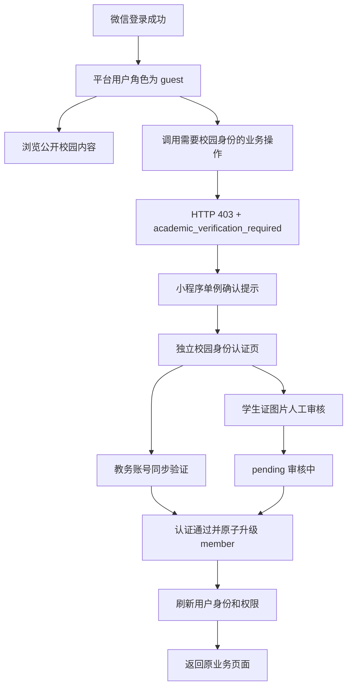

# OUSea：Guest 教务认证门槛与双路径绑定

**Priority:** High
**Status:** Done
**Type:** Feature
**Created:** 2026-07-25
**Last Updated:** 2026-07-25

## 一、概述

微信账号绑定只负责确认“这个微信用户是谁”，不能直接证明用户是在校学生。新用户完成微信登录后应正常创建账号并保持 `guest` 身份；当其执行发布、接单、加入拼车、交易等需要校园身份的操作时，后端返回可被客户端稳定识别的认证门槛错误，小程序再引导用户完成校园身份认证。

校园身份认证提供两条路径：

- 有可用教务账号：输入学号和教务密码，后端同步验证，成功后立即升级为 `member`。
- 没有可登录的教务账号：填写学生证上的姓名、学号并上传学生证图片，提交管理员人工审核；审核通过后升级为 `member`。

本功能复用现有 `academic_verification` 模块、私有材料存储、管理端审核和 Guest/Member 基础角色切换，不重复创建认证数据模型。

## 二、用户故事

**作为** 首次使用小程序的海大学生
**我想** 先完成微信登录并浏览校园内容，在真正需要发布或参与服务时再认证校园身份
**从而** 降低首次进入门槛，同时保证校园交易和互助只向已核验学生开放。

**作为** 没有可登录教务账号的学生
**我想** 上传学生证申请人工认证并查看审核状态
**从而** 不会因为教务账号不可用而无法使用校园服务。

## 三、现状与问题

### 3.1 已有能力

| 范围 | 已有实现 |
| --- | --- |
| 微信登录 | `POST /api/v1/auth/wechat/login` 创建或登录平台用户 |
| 基础角色 | 新用户默认 `guest`，认证通过后由后端原子切换为 `member` |
| 认证状态 | `GET /api/v1/academic-verification` 返回有效身份和最近一次申请 |
| 教务账号认证 | `POST /api/v1/academic-verification/credentials`，字段为 `student_no`、`password` |
| 材料上传 | `POST /api/v1/academic-verification/materials`，单张 JPEG、PNG 或 WebP，最大 5 MiB |
| 学生证申请 | `POST /api/v1/academic-verification/student-card`，字段为 `real_name`、`student_no`、`material_id` |
| 人工审核 | 管理端支持申请查看、材料受控读取、批准、驳回和身份撤销 |
| 业务门槛 | 业务 Schema 可声明 `academic_verification: required`，生成 Adapter 已执行认证检查 |

### 3.2 当前缺口

后端全局 `security` 中间件在生成 Adapter 之前执行 Casbin 权限检查。由于业务写接口默认只授予 `member`，`guest` 会先收到通用错误：

```json
{
  "error": {
    "code": "forbidden",
    "message": "无权执行此操作"
  }
}
```

生成 Adapter 中已有的 `academic_verification_required` 分支无法到达，小程序也就无法区分“需要校园身份认证”和“账号真的无权访问”。同时小程序没有独立认证页面、全局错误分流、材料上传封装和认证成功后的安全回跳。

## 四、产品目标与非目标

### 4.1 产品目标

- 微信登录成功始终返回正常登录结果，用户角色可以是 `guest`。
- 只有实际调用受校园身份保护的操作时才触发认证引导。
- 认证提示、页面跳转和审核状态对用户清晰可解释。
- 教务密码只用于本次服务端验证，不进入数据库、日志、前端持久化或 URL。
- 学生证图片使用现有加密私有存储，不生成可公开访问的链接。
- 认证成功后恢复用户上下文，但不自动重复执行可能产生副作用的业务操作。

### 4.2 非目标

- 不把微信登录失败、Token 失效和校园身份未认证合并为同一错误。
- 不新增自助解绑；身份撤销继续由管理员操作。
- 不在本期接入新的外部对象存储或真实教务 Provider。
- 不允许通过给 `guest` 批量授予业务写权限来绕过权限检查顺序。
- 不在小程序本地保存教务密码、学生证图片内容或完整学号身份快照。

## 五、核心流程



## 六、后端需求

### 6.1 错误契约

对已经登录、但尚未具备有效校园身份的用户：

- HTTP 状态：`403 Forbidden`
- 业务码：`academic_verification_required`
- 用户文案：`完成校园身份认证后才能执行此操作`
- 响应继续使用现有错误 Envelope，并包含 `request_id`

示例：

```json
{
  "error": {
    "code": "academic_verification_required",
    "message": "完成校园身份认证后才能执行此操作"
  },
  "request_id": "..."
}
```

以下情况必须保持原语义：

- 未登录或 Token 无效：`401`
- 已认证但 Casbin 不允许：`403 + forbidden`
- 普通管理接口或未声明认证门槛的接口无权限：`403 + forbidden`
- 教务认证服务不可用：`503 + academic_verification_unavailable`

### 6.2 权限检查顺序

生成式权限清单增加 `academic_verification` 元数据，并由运行时权限目录提供按请求方法、实际路径匹配 operation 的能力。

`security` 中间件执行顺序：

1. 验证 Access Token，设置 `user_id`。
2. 执行 Casbin 权限检查。
3. 若 Casbin 允许，继续进入生成 Adapter；Adapter 仍执行 `requireAcademicVerification`，防止自定义角色或超级管理员绕过。
4. 若 Casbin 拒绝且当前 operation 声明 `academic_verification: required`，查询本人有效校园身份：
   - 未认证：返回 `academic_verification_required`。
   - 已认证：返回普通 `forbidden`。
   - 查询失败或 Gate 未配置：返回认证服务错误，不伪装为权限不足。
5. 若 operation 未声明认证门槛，直接返回普通 `forbidden`。

不得根据“请求是 POST/PATCH/DELETE”简单推断是否需要认证，事实来源必须是业务 Schema。

### 6.3 生成器与权限元数据

- `schemas/*.yaml` 中的 `academic_verification` 继续作为唯一事实来源。
- 权限 JSON Manifest 为每个规则输出 `academic_verification: required|none`。
- 聚合相同权限时必须把认证门槛纳入分组键，避免不同方法的元数据互相覆盖。
- `permissionmanifest` 暴露运行时查询方法，支持 `:id` 路径模式与 HTTP Method 匹配。
- 不手改任何 `.gen.go` 文件；修改生成模板后运行完整生成流程。

### 6.4 现有认证接口

本期不新增认证业务端点，复用：

| 方法 | 路径 | 用途 | 关键规则 |
| --- | --- | --- | --- |
| GET | `/api/v1/academic-verification` | 查询本人认证状态 | `guest/member` 可访问 |
| POST | `/api/v1/academic-verification/credentials` | 学号、密码同步验证 | 需要 `Idempotency-Key`；失败限流；密码不持久化 |
| POST | `/api/v1/academic-verification/materials` | 上传学生证图片 | multipart；JPEG/PNG/WebP；最大 5 MiB |
| POST | `/api/v1/academic-verification/student-card` | 提交人工审核 | 需要 `Idempotency-Key`；材料仅可消费一次 |

教务账号验证成功和人工审核批准继续通过现有事务执行：

- 建立或替换有效 `AcademicIdentity`
- 将认证申请更新为 `approved`
- 将基础角色原子切换为 `member`
- 处理其他待审核申请
- 写入不含姓名、学号、密码和材料路径的领域事件

## 七、小程序需求

### 7.1 全局认证门槛处理

扩展 API Client 的错误处理：

- 识别 `ApiError.code === "academic_verification_required"`。
- 使用模块级 Promise/状态锁保证同一时刻最多展示一个认证提示。
- 提示标题为“需要校园身份认证”，说明认证后才能继续当前操作。
- 用户点击“去认证”时保存安全回跳目标，并通过 `Taro.navigateTo` 打开独立非 TabBar 页面。
- 用户取消时保留当前页面和输入内容，原请求仍以异常结束。
- 不在底层 Client 自动重放失败的业务写请求；返回后由页面保留表单或让用户再次点击操作。
- 在认证页本身调用认证接口时禁用再次弹出认证提示，避免循环跳转。

### 7.2 安全回跳

- 只允许回到小程序已注册的内部页面，不接收完整外部 URL。
- 回跳信息优先保存在内存或短期本地键中，不把表单、密码、Token 或图片路径拼接进 URL。
- 认证成功后先刷新 `/api/v1/auth/me` 或清除用户权限缓存，再按页面栈执行 `navigateBack`。
- 原页面通过 `useDidShow` 或等价生命周期重新拉取身份和业务状态。
- 页面栈不可恢复时回到触发业务所属页面；TabBar 页面使用 `switchTab`，非 TabBar 页面使用 `redirectTo` 或 `navigateBack`。

### 7.3 独立认证页面

新增 `/pages/academic-verification/index`，使用自定义导航栏，页面结构为：

1. **状态卡**
   - 未认证：说明认证后可发布、接单、交易和参与校园服务。
   - 审核中：展示提交时间和“材料审核中”，禁用重复提交。
   - 已认证：展示脱敏学号、认证方式和认证时间。
   - 已驳回：展示驳回原因和重新认证入口。
   - 已撤销：说明身份已失效，可重新认证。

2. **认证方式切换**
   - “教务账号”：学号、密码、提交按钮。
   - “学生证认证”：真实姓名、学号、学生证图片、提交审核按钮。

3. **安全说明**
   - 教务密码仅用于本次服务端验证，不在小程序保存。
   - 学生证图片只用于人工审核，采用私有加密存储并按保留策略清理。

页面支持下拉刷新、首次加载骨架、错误重试、键盘遮挡和底部安全区。

### 7.4 教务账号验证

- 学号和密码必填，输入时不做会泄露有效账号的远程探测。
- 密码输入使用安全输入，不提供明文持久化或自动填充。
- 提交时生成稳定的本次 `Idempotency-Key`，按钮进入 Loading 并阻止重复提交。
- `invalid_academic_credentials`：统一提示“学号或密码不正确”。
- `academic_credentials_limited`：提示稍后重试。
- `academic_provider_unavailable`：保留输入，提示服务暂不可用。
- 成功后立即清空密码状态，刷新用户与认证状态，然后回到原页面。

### 7.5 学生证人工认证

- “没有可登录的教务账号”入口切换到学生证认证。
- 真实姓名、学生证上的学号和一张学生证图片必填。
- 使用 `Taro.chooseMedia` 或微信端兼容的图片选择能力，仅允许图片。
- 客户端在选择后校验单文件大小不超过 5 MiB，服务端继续执行 MIME 签名和大小校验。
- 使用 `Taro.uploadFile` 以字段名 `file` 上传，携带 Access Token。
- 上传成功取得 `material_id` 后，再调用学生证提交接口。
- 若第二步失败且材料仍有效，页面保留 `material_id` 供用户重试，不重复上传相同图片。
- 提交成功后显示 `pending` 状态，不宣称认证已经通过。
- 审核驳回后展示 `review_reason`，允许选择新图片并重新提交。

## 八、状态映射

| 后端状态 | 页面状态 | 可执行动作 |
| --- | --- | --- |
| 无 identity、无 request | 未认证 | 选择任一认证方式 |
| `latest_request.status = pending` | 审核中 | 刷新状态、返回浏览 |
| `identity.status = verified` | 已认证 | 返回原业务页 |
| `latest_request.status = rejected` | 已驳回 | 查看原因、重新提交 |
| `latest_request.status = superseded` | 已由新认证替代 | 刷新当前身份 |
| `identity.status = revoked` 或 request 为 `revoked` | 已撤销 | 重新认证 |

当 `identity.status = verified` 与最近申请状态不一致时，以有效 Identity 为最终是否可用的判断依据，申请状态只用于解释认证历史。

## 九、文件范围

### 9.1 小程序新增

- `src/api/academic-verification.ts`：状态查询、凭据验证、材料上传、学生证提交。
- `src/features/academic-verification/guard.ts`：错误分流、单例提示、安全回跳。
- `src/pages/academic-verification/index.tsx`：独立认证页面。
- `src/pages/academic-verification/index.scss`：页面视觉样式。
- `src/pages/academic-verification/index.config.ts`：自定义导航和下拉刷新配置。

### 9.2 小程序修改

- `src/api/client.ts`：接入认证门槛错误处理与可选跳过 Guard。
- `src/api/auth.ts`：认证成功后刷新用户、角色和权限缓存。
- `src/app.config.ts`：注册独立认证页面。
- `src/pages/profile/index.tsx`：校园身份入口改为真实认证页并显示真实状态。
- 现有跑腿、二手、拼车详情与发布器：移除各自跳“我的”页的临时认证提示，统一由 Guard 处理。

### 9.3 后端修改

- `internal/generator/schema.go`：权限元数据携带认证门槛并正确聚合。
- 生成权限 Manifest 的模板或序列化结构：输出 `academic_verification`。
- `permissions/embed.go`：解析并提供认证门槛匹配。
- `internal/core/permission/service.go`：暴露按 Path/Method 查询认证门槛的只读能力。
- `internal/api/httpapi/middleware.go`：在 Casbin 拒绝时分流认证门槛错误。
- 相关生成器、权限、HTTP Handler 测试。

生成产物由 `make generate` 更新，包括权限 Manifest、模块 OpenAPI 快照、全局 OpenAPI、HTTP Adapter 和 API 类型；禁止直接编辑生成文件。

## 十、安全与隐私

- 教务密码只存在于当前页面内存和一次 HTTPS 请求体，提交完成或页面卸载即清空。
- 禁止在错误日志、埋点、请求 ID、幂等键、本地草稿、URL 或领域事件中包含密码。
- 学号不放入回跳参数、通知载荷或客户端长期缓存；已认证状态展示时只显示脱敏值。
- 图片必须由服务端通过文件签名确认 JPEG、PNG 或 WebP，不能信任扩展名和客户端 MIME。
- 上传材料继续使用 AES-256-GCM 私有存储、随机键和现有清理 Worker。
- 小程序 Guard 只处理稳定业务码，不根据中文错误文案做判断。
- 已认证但无业务权限时不得提示重新认证，以免形成错误授权暗示。

## 十一、测试与验收

### 11.1 后端自动化测试

- 新创建用户只有 `guest` 基础角色，微信登录返回成功。
- `guest` 调用声明 `academic_verification: required` 的写接口，返回 `403 + academic_verification_required`。
- `guest` 调用未声明认证门槛的受限接口，返回 `403 + forbidden`。
- 有有效 Identity 但缺少 Casbin 权限的用户，返回 `403 + forbidden`。
- 自定义角色或超级管理员通过 Casbin 后，仍不能绕过生成 Adapter 的认证门槛。
- 教务账号验证成功后原子切换为 `member`，相同业务请求可以继续通过权限层。
- 学生证申请批准后切换为 `member`；驳回和撤销保持或恢复 `guest`。
- 路径参数路由与静态路由均能正确匹配认证元数据。
- 生成权限 Manifest 与 Schema 快照一致，`make generate-check` 无漂移。

### 11.2 小程序自动与构建检查

- API 错误解析能够稳定识别 `academic_verification_required`。
- 并发受限请求只展示一个提示，不产生多次页面跳转。
- 认证页不会因自身请求错误再次触发认证跳转。
- 教务密码提交后被清空，且不进入本地存储。
- 学生证上传正确携带 Token，成功后使用 `material_id` 提交审核。
- `npx tsc --noEmit`、`npm run build:weapp` 和 `git diff --check` 通过。

### 11.3 微信开发者工具验收

- 首次微信登录成功后用户为 `guest`，可以浏览公开社区和生活服务内容。
- 点击发布、接单、加入拼车或购买时出现一次认证提示。
- 取消提示后停留原页面，已填写表单不丢失。
- 确认后进入独立认证页，右上角胶囊、自定义 Header、键盘和底部安全区无重叠。
- 教务账号认证成功后回到原页面，用户再次点击业务操作可以正常继续。
- 学生证提交后展示审核中；管理员通过后下拉刷新显示已认证并可回到业务。
- 驳回原因可见，重新提交不会复用已消费材料。
- 图片超过 5 MiB、格式不支持、网络中断、Token 刷新失败均有明确反馈。

## 十二、实施顺序

1. 修改后端生成元数据与运行时匹配能力。
2. 修正权限中间件分流并补齐后端测试。
3. 重新生成 OpenAPI 和小程序 API 类型。
4. 实现小程序认证 Repository、上传封装和统一 Guard。
5. 实现独立认证页面与个人页入口。
6. 联调教务账号验证和学生证人工审核。
7. 完成构建、生成检查和微信开发者工具验收。

## 十三、风险与决策

- **权限顺序风险：** 不能简单让 `guest` 获得全部业务写权限，否则第三方客户端可能越过预期授权边界。采用生成元数据分流，并保留 Adapter 二次校验。
- **重复请求风险：** 认证后自动重放发布、接单或下单可能产生副作用。决定不自动重放，由用户返回后再次确认。
- **弹窗风暴风险：** 页面初始化可能并发请求多个接口。Guard 必须单例化提示和跳转。
- **材料生命周期风险：** 图片上传成功但申请提交失败时会产生未绑定材料。复用现有 24 小时清理机制，并在页面内短期保留 `material_id` 以供重试。
- **教务 Provider 风险：** 当前后端仍可能使用 Mock Provider。本任务完成认证闭环，但不等同于已经接入学校真实教务系统。

---

**Implementation Notes：**

- 小程序基于 Taro 4.1.11，内部非 TabBar 页面使用 `Taro.navigateTo`，返回时遵守微信小程序页面栈限制。
- 图片选择和上传分别使用 Taro 媒体 API 与 `Taro.uploadFile`，服务端验证仍是安全事实来源。
- 后端遵守 Schema 驱动和生成边界，不直接修改带 `DO NOT EDIT` 的生成文件。
- 规格获批后先将 Task 状态更新为 `To Do`、PRD 状态更新为 `In Progress`，再开始编码。
