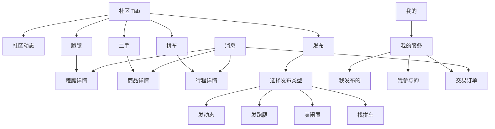
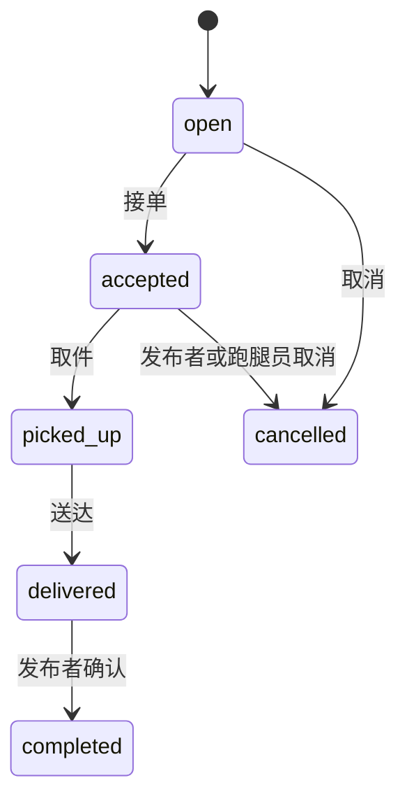
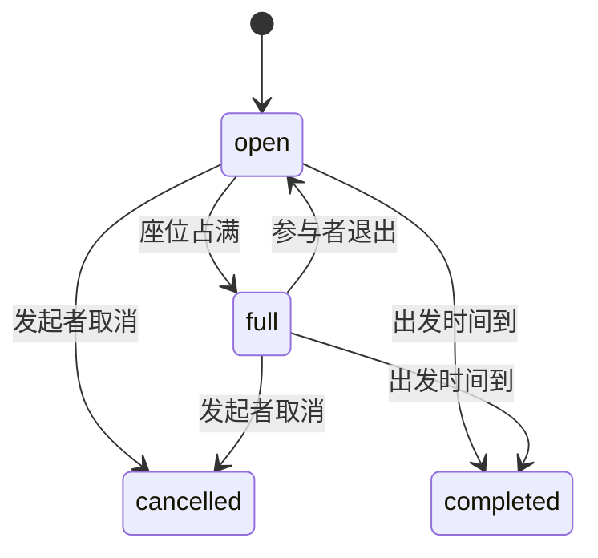
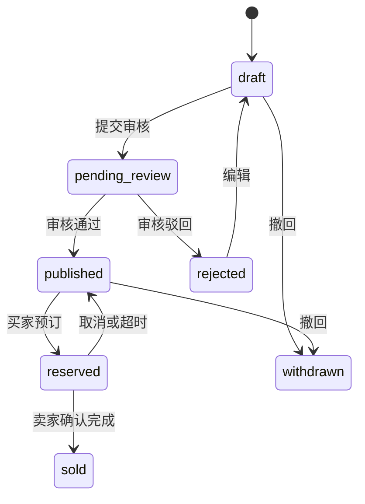

# 海大校园小程序：校园生活服务后端联动重构

**Priority:** High
**Status:** In Progress
**Type:** Feature
**Created:** 2026-07-25
**Last Updated:** 2026-07-25

## 一、概述

当前小程序已经形成“社区、跑腿、二手、拼车”的顶层布局，但后三类业务仍使用前端内存 Mock，详情通过 URL 拼接整段文案，发布器只把通用表单写入本地存储。与之相比，后端已经具备较完整的认证、学籍验证、审核、状态流转、评论、订单、幂等和乐观锁能力，两端之间存在明显断层。

本项目将校园生活服务重构为一个统一入口、三个独立业务领域和一个类型化发布体系：

- 社区 Tab 负责发现与切换，不承担全部业务逻辑。
- 跑腿、二手、拼车各自拥有列表呈现、详情、状态动作和发布表单。
- 发布器使用同一个页面、统一交互骨架和统一草稿机制，通过业务 Schema 加载不同结构化字段，不拆成多套页面。
- 小程序只消费后端返回的 `viewer_relation` 与 `available_actions`，权限与状态规则由后端作为事实来源。
- 真实交易仅支持线下履约与线下付款，不在界面中制造“已支付”假象。

## 二、用户故事

**作为** 已完成校园身份认证的海大学生
**我想** 在一个清晰可信的入口浏览、发布和参与校园互助与交易
**从而** 快速完成取送、闲置流转和同路出行，并随时掌握审核与履约进度。

**作为** 内容或需求发布者
**我想** 保存草稿、按业务填写结构化信息、查看审核原因并继续编辑
**从而** 不必重复填写，也不会误以为提交后立即公开。

**作为** 接单者、买家或拼车参与者
**我想** 只看到自己当前可以执行的动作和受控联系方式
**从而** 避免无效操作、信息泄露和交易误解。

## 三、现状审计

### 3.1 小程序现状

| 范围 | 当前实现 | 主要问题 |
| --- | --- | --- |
| 生活服务首页 | `pages/community/index` 内同时维护社区、跑腿、二手、拼车 | 组件过重，业务状态互相耦合，无法按领域演进 |
| 跑腿/二手/拼车列表 | TypeScript 常量 `serviceListings` | 无分页、刷新、错误处理、真实状态与用户关系 |
| 通用详情 | `pages/community/detail` 从 URL 读取标题、正文等 | 不能刷新恢复，无法校验权限，不能执行真实状态动作 |
| 发布器 | `pages/publish/index` 通用标题、正文、地点、价格 | 字段与后端契约不一致，仅保存到 `campus.mockPublications.v1` |
| 认证与网络 | 无 API Client、令牌、刷新和契约类型层 | 目前无法安全接入任何受保护接口 |
| 消息 | 本地 Mock 消息 | 未消费后端通知中心，也无法按资源跳转 |
| 我的服务 | “我的发布”仍跳通用发布器 | 缺少我发布、我接单、我参与、我的订单 |

### 3.2 后端已具备能力

| 领域 | 已有能力 |
| --- | --- |
| 认证 | 微信 `code` 登录、Access Token、Refresh Token、当前用户与权限 |
| 校园身份 | 认证状态查询、学生证材料、教务凭据校验；关键业务写操作要求认证 |
| 跑腿 | 发布、审核、编辑、接单、取件、送达、完成、取消、我的发布/接单 |
| 拼车 | 发布、审核、搜索、加入、退出、取消、我的发起/参与、到期完成 |
| 二手 | 草稿、提交审核、编辑、撤回、预订、订单取消/完成/过期、我的商品 |
| 订单 | 统一线下交易订单，支持二手与跑腿，使用快照和状态流转 |
| 评论 | 已支持 `marketplace`、`errand`、`carpool`、`campus_circle_post` 等目标 |
| 通知 | 站内通知列表、详情、未读数、单条/全部已读 |
| 安全 | Casbin 权限、学籍门槛、幂等键、乐观锁、联系信息加密与按关系展示 |

### 3.3 后端缺口

1. 通用业务图片没有上传 API。二手与社区仅接收 HTTPS URL；现有材料上传是学籍认证专用，不能复用为公开业务图片。
2. 没有举报领域与用户举报 API，当前前端“举报内容”只是空交互。
3. 跑腿缺少任务类型、校区等结构化字段，无法可靠实现“帮取、帮送、代买”筛选。
4. 二手缺少分类、成色、校区、交付方式等字段。
5. 拼车缺少发起角色、人均费用、补充说明等字段，当前契约只能表达路线、时间和座位。
6. 跑腿与拼车创建后直接进入审核，缺少与二手一致的服务端草稿语义。
7. 领域事件通知只覆盖二手订单和学籍认证；跑腿、拼车、评论回复尚未形成站内通知。
8. 通知 `action_path` 当前偏向 API 资源路径，不是稳定的小程序深链。
9. 当前用户响应只有账号、角色和权限，不包含适合前台展示的昵称、头像与学院摘要。

## 四、产品目标与非目标

### 4.1 产品目标

- 用户在社区 Tab 中一眼看见社区、跑腿、二手、拼车四种服务。
- 三类服务首屏可完成浏览、搜索、筛选和发布，不增加无意义的中转页。
- 详情页围绕“信息、可信度、当前状态、下一步动作”组织内容。
- 发布器在不同业务间保持一致操作习惯，同时提供各自必需字段。
- 所有写操作可恢复、可防重、可处理版本冲突，状态变化可在消息和“我的服务”中追踪。
- 联系方式只在关系与状态满足后展示，不在列表、日志、通知或分享卡中泄漏。

### 4.2 非目标

- 不实现微信支付、平台担保、退款或抽佣。
- 不实现即时聊天、语音、群聊或好友系统。
- 不实现基于精确 GPS 的附近排序；校区与地点先使用结构化文本。
- 不在本期重构失物招领领域。
- 不把跑腿、拼车、二手合并为一张万能业务表。

## 五、信息架构



### 5.1 社区 Tab

保留当前已确认的双层导航逻辑：

- 第一层：社区、跑腿、二手、拼车。
- 第二层：当前业务的业务筛选。
- 顶部搜索随当前业务切换。
- 发布按钮直接进入当前业务发布页；从全局发布入口进入时先选择类型。

产品上仍是一个 Tab，代码上拆成独立 Feature 容器与 Repository，避免 `community/index.tsx` 同时持有全部列表、详情和交互数据。

### 5.2 各业务二级筛选

| 业务 | 推荐子筛选 | 数据来源 |
| --- | --- | --- |
| 社区 | 推荐、校园生活、学习互助、找搭子、摄影记录 | 校园圈 Section |
| 跑腿 | 全部、帮取、帮送、代买、其他 | 新增 `task_type` |
| 二手 | 推荐、数码、书籍、生活、运动、其他 | 新增 `category` |
| 拼车 | 全部、今天、明天、本周末 | `departure_at` |

“我的发布”不放在公共筛选中，统一进入“我的服务”，避免公共列表与个人状态列表混杂。

## 六、核心页面方案

### 6.1 跑腿列表

- 顶部使用温暖薄荷色服务概览卡，展示“待接任务数”和“发布跑腿”。
- 卡片第一视觉是报酬、任务类型与剩余时间。
- 路线使用“取件地 → 送达地”垂直或横向路径。
- 展示校区、发布时间、是否急件；列表不展示明文联系方式。
- 支持关键词、任务类型、校区、分页与下拉刷新。
- 点击卡片按稳定 ID 打开 `/pages/errands/detail?id=...`。

### 6.2 跑腿详情

- 状态卡显示审核状态与业务状态，审核驳回时优先展示原因。
- 信息区展示报酬、截止时间、取送路线、物品说明和图片。
- 评论区复用后端 Comment 模块。
- 底部操作条完全根据 `available_actions` 映射：
  - `verify_academic`：去认证
  - `accept`：确认接单
  - `pickup`：确认取件
  - `deliver`：确认送达
  - `complete`：发布者确认完成
  - `edit`、`submit_review`、`cancel`
- 接单成功后才展示后端授权的联系方式。

### 6.3 二手列表

- 使用双列商品卡，图片优先；无图时使用业务色占位卡。
- 卡片展示价格、成色、分类、校区和发布时间。
- 支持关键词、分类、价格区间、校区与排序。
- 公共列表只显示 `published` 商品。
- 点击商品按 ID 打开 `/pages/marketplace/detail?id=...`。

### 6.4 二手详情

- 图片轮播、价格、原价、成色、分类、交付方式、地点和描述。
- 清晰展示“线下交易，平台不代收款”。
- `purchase` 映射为“我想要”，成功后商品进入预留并创建订单。
- 有效买家与卖家可看到联系方式；无关系用户仅显示脱敏值。
- 所有者按状态显示编辑、提交审核或撤回。
- 评论、举报、分享使用统一资源动作。

### 6.5 拼车列表

- 卡片第一视觉为“起点 → 终点”、出发日期和时间。
- 展示发起类型、剩余座位、人均费用和集合点。
- 支持出发地、目的地、日期、所需座位与关键词搜索。
- 点击按 ID 打开 `/pages/carpool/detail?id=...`。

### 6.6 拼车详情

- 路线卡展示起终点、集合说明和出发倒计时。
- 人数区展示已占/总座位，不暴露参与者敏感信息。
- `join`、`leave`、`cancel`、`edit`、`submit_review` 由后端动作决定。
- 加入后展示联系方式；到出发时间后页面自动刷新状态。
- 明确提示“请确认车型、费用和实际行程，平台不提供营运担保”。

### 6.7 我的服务

提供三段切换，但它是独立页面内的个人聚合，不占社区公共筛选：

- 我发布的：跑腿、商品、拼车，按审核中、进行中、已结束分组。
- 我参与的：我接的跑腿、我加入的拼车。
- 交易订单：二手与跑腿订单，显示买卖/发布关系和履约状态。

列表卡片显示可执行的下一步动作，避免用户必须进入详情才能知道进度。

## 七、发布器重构

### 7.1 路由设计

- `/pages/publish/index`：唯一发布器页面。
- `section=community|errands|market|carpool`：选择发布类型。
- `id` 与 `mode=edit`：进入对应资源编辑。
- `mode=resubmit`：编辑审核驳回内容并重新提交。

从某个业务列表点击发布时带入 `section`，直接展示对应结构字段；从全局发布入口进入时，在发布器顶部选择类型。切换类型会保留各类型独立草稿，但不会把上一类型字段写入当前业务。

### 7.2 统一交互骨架

统一发布器共享以下体验：

- 自定义 Header：返回、业务标题、草稿状态。
- 内容区：基础信息、业务信息、联系方式、安全提示。
- 图片选择、压缩、排序、删除、失败重试。
- 输入时节流自动保存本地草稿。
- 离开页面时若有未保存变更，提示保留草稿或放弃。
- 底部双动作：“保存草稿”和“提交审核”。
- 提交前只定位第一个错误，不用连续 Toast 轰炸用户。
- 成功后进入资源详情，并显示“审核中”而不是“发布成功”。

### 7.3 跑腿字段

| 字段 | 规则 |
| --- | --- |
| 任务类型 | 帮取、帮送、代买、其他；必填 |
| 标题 | 1–60 个中文显示字符 |
| 详细说明 | 1–1000 字 |
| 取件地、送达地 | 必填，提供常用校内地点快捷选择 |
| 截止时间 | 必须晚于当前时间 |
| 报酬 | 大于 0，前端以元输入、后端以分存储 |
| 图片 | 0–3 张 |
| 联系方式 | 手机、微信、QQ；默认复用最近一次选择 |

### 7.4 二手字段

| 字段 | 规则 |
| --- | --- |
| 图片 | 1–9 张，第一张为封面 |
| 标题 | 1–60 个中文显示字符 |
| 分类 | 数码、书籍、生活、运动、服饰、其他 |
| 成色 | 全新、几乎全新、轻微使用、明显使用 |
| 售价 | 必填且大于 0 |
| 原价 | 可选，不得低于售价时只提示不阻止 |
| 交付方式 | 校内面交、自提 |
| 校区与地点 | 必填 |
| 描述 | 1–2000 字 |
| 联系方式 | 手机、微信、QQ |

### 7.5 拼车字段

| 字段 | 规则 |
| --- | --- |
| 发起类型 | 车找人、找同路；必填 |
| 起点、终点 | 必填 |
| 出发时间 | 必须晚于当前时间 |
| 可加入人数 | 1–20 |
| 人均费用 | 可为 0，明确“AA/免费/固定金额” |
| 集合说明 | 可选 |
| 补充说明 | 行李、返程、车型等，不超过 1000 字 |
| 图片 | 0–3 张，不要求上传车辆证件 |
| 联系方式 | 手机、微信、QQ |

### 7.6 草稿策略

- 本地草稿键：`lifePublisher.drafts.v1`，按发布类型与资源 ID 分区。
- 图片上传成功后记录媒体 ID；未提交的媒体由后端定时清理。
- 后端统一支持草稿与提交审核：
  - 二手沿用现有 `draft → pending_review`。
  - 跑腿、拼车扩展为创建草稿，再显式 `submit-review`。
- 为兼容既有调用，创建接口增加 `submission_mode: draft | review`，默认保持当前行为；新小程序明确传 `draft`。

## 八、状态与动作

### 8.1 双状态原则

跑腿与拼车同时存在审核状态和业务状态，前端不得把两者拼成一个不可逆枚举。

- 审核状态：`draft`、`pending_review`、`approved`、`rejected`
- 业务状态：由各领域独立维护

显示优先级：

1. 驳回原因或审核中
2. 当前业务履约状态
3. 当前用户可执行动作

### 8.2 跑腿



### 8.3 拼车



### 8.4 二手



## 九、后端契约方案

### 9.1 沿用现有接口

- 微信登录：`POST /api/v1/auth/wechat/login`
- 刷新令牌：`POST /api/v1/auth/refresh`
- 当前用户：`GET /api/v1/auth/me`
- 学籍状态：`GET /api/v1/academic-verification`
- 跑腿：`/api/v1/errands`
- 拼车：`/api/v1/carpool/trips`
- 二手：`/api/v1/marketplace/listings`
- 订单：`/api/v1/orders`
- 评论：`/api/v1/comments`
- 通知：`/api/v1/notices`

### 9.2 扩展现有 Schema

#### Errand

- 新增 `task_type`
- 新增 `campus_code`
- 新增 `image_urls`
- 创建请求新增 `submission_mode`
- 公共列表新增 `task_type`、`campus_code` 筛选

#### Marketplace

- 新增 `category`
- 新增 `condition`
- 新增 `campus_code`
- 新增 `trade_mode`
- 新增可选 `original_price_cents`
- 公共列表新增分类、校区与排序参数

#### Carpool

- 新增 `trip_type`
- 新增 `fee_cents`
- 新增 `meeting_note`
- 新增 `description`
- 新增 `image_urls`
- 创建请求新增 `submission_mode`

### 9.3 新增 Media 模块

建议接口：

- `POST /api/v1/media/uploads`：`multipart/form-data` 上传图片
- `DELETE /api/v1/media/uploads/{id}`：删除本人未绑定媒体
- 响应返回 `id`、`url`、`mime_type`、`size_bytes`、`width`、`height`、`status`

约束：

- JPEG、PNG、WebP
- 单张不超过 10 MB
- 服务端校验真实 MIME、尺寸和内容摘要
- URL 必须来自受控对象存储域名
- 资源绑定后禁止普通用户直接删除
- 未绑定资源定时过期清理

学籍认证材料是私密加密材料，不得迁移或复用为公开媒体。

### 9.4 新增 Report 模块

建议接口：

- `POST /api/v1/reports`
- `GET /api/v1/reports/mine`
- `GET /api/v1/admin/reports`
- `POST /api/v1/admin/reports/{id}/resolve`

字段：

- `target_type`：community_post、comment、errand、marketplace、carpool
- `target_id`
- `reason_code`：spam、fraud、unsafe、harassment、prohibited、other
- `detail`
- `evidence_urls`
- `status`
- `reporter_id`

同一用户对同一资源的未处理举报应幂等，管理员处理后可触发既有撤销审核或下架动作。

### 9.5 通知扩展

新增领域事件通知：

- 跑腿审核、被接单、取件、送达、完成、取消
- 拼车审核、加入、退出、满员、取消、完成
- 评论审核、收到评论、收到回复

通知新增结构化跳转字段：

- `action_type`
- `resource_type`
- `resource_id`

保留 `action_path` 作为兼容字段，但新小程序优先使用结构化字段映射页面。

## 十、小程序技术方案

### 10.1 分层

```text
pages
  ↓
features/life-services
  ↓
repositories
  ↓
api client + generated contract types
  ↓
Campus Platform API
```

- Page：只处理页面生命周期、路由参数和组合布局。
- Feature：业务组件、展示模型和交互状态。
- Repository：分页、缓存、DTO 到 ViewModel 映射。
- API Client：认证、刷新、请求头、Envelope、错误和幂等。

### 10.2 API Client

- App 首次需要用户能力时调用 `Taro.login`，将 `code` 与 App ID `wx0d9936d6708f44c0` 提交后端。
- Access Token 与 Refresh Token 分开存储，刷新请求使用单飞锁，避免并发刷新。
- 401：尝试刷新一次，失败则清理会话并重新登录。
- 403 且动作包含 `verify_academic`：进入认证引导。
- 409：重新拉取资源，提示“状态已更新”，不静默覆盖。
- GET 可有限重试；写操作仅使用同一幂等键重放，不生成新键自动重试。
- 每次写操作发送稳定 `Idempotency-Key`，更新和状态动作发送最新 `expected_version`。
- 后端 Error Envelope 的 `code`、`message`、`request_id` 保留到错误对象，便于排查。

### 10.3 缓存与刷新

- 列表采用页面级缓存，切换业务后返回时恢复滚动位置和筛选。
- 下拉刷新重置第一页；触底加载下一页。
- 详情操作成功后更新详情缓存，并使相关列表缓存失效。
- 创建或编辑成功后通过事件总线标记列表需要刷新。
- 不缓存明文联系方式；页面隐藏或关系失效后重新请求详情。

### 10.4 类型契约

- 后端 `api/openapi.yaml` 是唯一契约来源。
- 在小程序仓库加入同步和生成命令，生成文件单独存放。
- 页面和 Repository 不手写后端枚举字符串，统一从生成类型与领域映射表消费。
- 实施前使用项目锁定版本的 Taro 官方文档核对 `request`、`uploadFile`、路由、存储和下拉刷新行为。

## 十一、视觉与交互系统

### 11.1 视觉方向

延续“清新校园服务平台”，将当前偏冷的青蓝色调整为温暖、丰富但不浓重的业务配色：

| Token | 建议色值 | 用途 |
| --- | --- | --- |
| 页面背景 | `#F7F8F3` | 温暖灰白 |
| 主品牌色 | `#3F8F83` | 导航、主按钮、可信标识 |
| 主品牌浅色 | `#DFF1EA` | 选中背景、轻提示 |
| 跑腿色 | `#F2A06B` | 报酬、跑腿标识 |
| 二手色 | `#E77976` | 价格、商品标识 |
| 拼车色 | `#708FC9` | 路线、行程标识 |
| 社区色 | `#8C78B8` | 社区话题 |
| 正文 | `#23342F` | 主要文字 |
| 次要文字 | `#6C7D76` | 辅助信息 |
| 卡片 | `rgba(255,255,255,0.88)` | 半玻璃卡片 |

不直接采用高饱和紫绿 Marketplace 模板；其“搜索优先、信任提示、清晰 CTA”结构保留，颜色调整为适合海大场景的暖青、珊瑚与柔蓝。

### 11.2 字体与密度

- 中文字体使用系统字体栈，以苹方为主，不下载外部字体。
- 页面主标题 36–40rpx，卡片标题 30–32rpx，正文 28rpx，辅助信息不低于 24rpx。
- 主要点击区域最小 88rpx。
- 卡片圆角 24–30rpx，阴影轻、边框可见，避免过度新拟态造成低对比。
- 价格、报酬、剩余座位使用数字层级，不依赖颜色单独传达状态。

### 11.3 小程序规范

- 自定义 Header 根据状态栏与右上角胶囊动态计算安全区域。
- 业务 Tab 与 Header 固定时不得遮挡胶囊和系统返回区域。
- 下拉刷新使用页面原生能力优先；内部长列表需要保持明确滚动容器边界。
- 分享、拨号、复制联系方式等使用微信原生能力，并在动作前说明结果。
- 所有遮罩和底部面板处理安全区、背景滚动锁定与返回键。

## 十二、可信与安全

- 写操作要求学籍认证，浏览可在已登录访客权限下进行。
- 列表只展示发布者匿名化身份摘要，不展示学号、手机号、微信号。
- 联系信息以服务端授权结果为准，不通过前端 ID 判断关系。
- 线下交易提示固定展示在二手订单和跑腿履约确认处。
- 拼车声明平台只提供信息撮合，不验证营运资质。
- 举报必须可追踪、可去重、可由管理员处理。
- 图片与文本都进入审核状态，不允许前端显示为“立即公开”。
- 分享卡只含公开字段，禁止包含联系方式、订单号或审核原因。

## 十三、文件影响预估

### 13.1 小程序新增

- `src/api/client.ts`
- `src/api/auth.ts`
- `src/api/generated/`
- `src/features/life-services/`
- `src/pages/errands/detail.tsx`
- `src/pages/marketplace/detail.tsx`
- `src/pages/carpool/detail.tsx`
- `src/features/publisher/schema.ts`
- `src/features/publisher/storage.ts`
- `src/features/publisher/fields/`
- `src/pages/my-services/index.tsx`
- `src/pages/trades/detail.tsx`

### 13.2 小程序修改

- `src/app.config.ts`
- `src/app.ts`
- `src/pages/community/index.tsx`
- `src/pages/community/detail.tsx`
- `src/pages/messages/index.tsx`
- `src/pages/profile/index.tsx`
- `src/custom-tab-bar/`
- `package.json`

### 13.3 后端新增或修改

- `schemas/errand.yaml`
- `schemas/carpool.yaml`
- `schemas/marketplace.yaml`
- `schemas/notice.yaml`
- `schemas/media.yaml`
- `schemas/report.yaml`
- `internal/modules/media/`
- `internal/modules/report/`
- 三个业务模块的 Domain、Application、Infrastructure 与 HTTP 扩展点
- `internal/infrastructure/domainevent/notice_publisher.go`
- 版本化迁移、生成 OpenAPI、权限和 Query 文件

## 十四、验收标准

### 14.1 认证与契约

- 微信登录后可获得并安全刷新令牌。
- 令牌过期时并发请求只触发一次刷新。
- 所有写操作具备幂等键，重复点击不会创建重复资源。
- 409 版本冲突不会覆盖其他用户或旧页面产生的新状态。

### 14.2 浏览

- 三类业务都支持真实分页、筛选、下拉刷新、触底加载。
- 切换一级业务后返回，筛选与滚动位置可恢复。
- 空数据、无搜索结果、首次加载、增量加载和失败重试状态完整。
- 详情刷新后可仅凭 ID 恢复，不依赖上一页 URL 文案。

### 14.3 发布

- 四类发布页字段与后端契约一致。
- 本地草稿可在退出并重新进入后恢复。
- 图片上传失败可重试，删除未绑定图片后不会留下永久公开资源。
- 提交后明确展示审核中，审核驳回可查看原因、编辑并重新提交。
- 版本冲突时保留用户未提交输入并提供重新加载。

### 14.4 业务闭环

- 跑腿可完成发布、审核、接单、取件、送达、确认完成和取消。
- 拼车可完成发布、审核、加入、退出、满员、取消和到期完成。
- 二手可完成草稿、审核、预订、取消、卖家完成和超时释放。
- 联系方式仅在后端允许时显示。
- 评论可发布、回复、加载线程；举报可提交且不会重复创建未处理记录。

### 14.5 消息与我的服务

- 领域状态变化生成站内通知。
- 消息点击可跳转对应详情或订单，返回后仍保留 TabBar。
- 未读数、单条已读和全部已读与后端一致。
- “我的服务”正确区分发布者、接单者、拼车参与者和交易双方。

### 14.6 构建与后端检查

小程序：

- `npx tsc --noEmit`
- `npm run build:weapp`
- `git diff --check`
- 微信开发者工具加载 `dist`，无 WXML/WXSS/运行时错误

后端：

- 所有 Go 改动执行 `gofmt`
- 目标包 `go test`
- `make generate-check`
- `make migration-check`
- 涉及分层时执行 `make check-architecture`
- `git diff --check`

## 十五、实施顺序与迁移

1. 先修改后端 Schema 与契约，补齐媒体、举报和结构化字段。
2. 生成并固定新的 `api/openapi.yaml`。
3. 小程序同步契约，建立 API Client 和认证。
4. 先接列表与详情的只读链路，再接写操作。
5. 重构发布器并迁移本地 Mock 草稿；旧 `campus.mockPublications.v1` 仅提示用户，不自动上传。
6. 接入“我的服务”、订单和通知。
7. 接入评论、举报和全部状态动作。
8. 完成微信开发者工具与后端本地环境联合验收。

发布采用功能开关：

- `life_services_api_enabled`
- `life_services_publisher_enabled`

先允许测试成员使用真实接口，确认数据与审核流程后再全量开启。关闭开关时显示维护状态，不回退到会误导用户的 Mock 数据。

## 十六、主要风险

| 风险 | 处理 |
| --- | --- |
| 后端扩展范围较大 | 先冻结契约，再并行实现后端和前端基础层 |
| 通用图片存储尚未选型 | 抽象 Media Store，本地和对象存储使用同一接口 |
| 联系方式泄露 | 只消费服务端授权值，不落本地缓存，不进日志与通知 |
| 写操作重复或页面状态过旧 | 幂等键 + `expected_version` + 409 恢复流程 |
| 社区 Tab 继续膨胀 | Page 只做容器，业务列表迁入独立 Feature |
| 用户误解平台担保 | 线下支付和信息撮合提示在关键动作前重复确认 |
| 审核导致“发布后看不到” | 提交成功直接进入本人可见详情并显示审核状态 |

## 十七、已确定的建议默认项

- 继续保留社区 Tab 的四个一级入口，不新增底部 Tab。
- 三类业务详情使用独立页面，不再复用通用详情模板。
- 发布器采用单页统一框架，由类型化 Schema 决定字段、校验、提交与编辑映射。
- 跑腿、二手、拼车的列表卡片必须使用各自结构化字段，不以标题、正文、标签、价格组成万能卡片。
- 任何后端已有搜索或结构化筛选能力的列表，首个可用版本必须同时接入搜索；不先交付只能滚动浏览的过渡版本。
- 公共列表不放“我的发布”，个人状态统一放“我的服务”。
- 线下付款，不接微信支付。
- 不做即时聊天，使用受控联系方式。
- 跑腿与拼车补齐服务端草稿能力。
- 媒体与举报作为正式后端模块建设，不使用临时第三方 URL 或空交互。
- 第一阶段优先完成跑腿、二手、拼车；失物招领后续单独设计。

## 十八、审批点

本方案建议一次确认以下产品决策后进入实现：

1. 社区 Tab 保留四个一级入口，详情使用独立页面，发布使用统一发布器。
2. 接受后端新增 Media、Report 模块和三类业务字段扩展。
3. 接受本期只支持线下付款与受控联系方式，不建设即时聊天。
4. 接受按“后端契约与搜索 → API 基础 → 结构化卡片和详情 → 统一发布器 → 履约消息”的顺序实施。

PRD 未确认前不修改业务代码；确认后更新任务状态并开始第一阶段。
