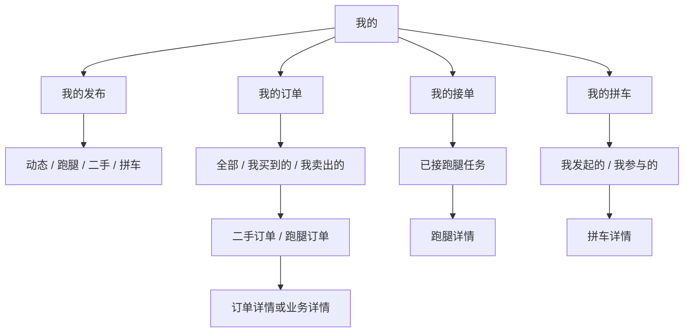

# OUSea小程序：我的接单、我的订单与我的拼车

**Priority:** High
**Status:** Done
**Type:** Feature
**Created:** 2026-07-26
**Last Updated:** 2026-07-26

## 一、概述

当前小程序已经接入微信登录、校园身份认证以及跑腿、二手、拼车的公共列表和详情，但个人中心只提供一个笼统的“我的服务”入口。该页面把跑腿和拼车固定请求为 `relation=all`，没有“我发布的 / 我接的”“我发起的 / 我参与的”视角；交易订单虽然已有后端接口，却没有强类型响应契约和小程序页面，因此用户完成接单、购买或拼车参与后，很难在个人中心找到记录。

本需求将个人业务记录建设为真实、可追踪、可操作的数据闭环。后端继续作为状态、用户关系和可执行动作的唯一事实来源；小程序负责按场景组织列表、呈现状态和发起后端允许的操作。

## 二、用户故事

**作为** 跑腿接单者
**我想** 在“我的接单”中看到自己接受的全部任务及当前履约步骤
**从而** 能继续取件、送达、取消或查看任务结果。

**作为** 二手买家、卖家或跑腿交易参与者
**我想** 在“我的订单”中查看订单状态和下一步操作
**从而** 不会在完成操作后丢失交易记录。

**作为** 拼车发起者或参与者
**我想** 分别查看我发起和我加入的行程
**从而** 能及时查看出发时间、行程状态和退出/取消能力。

## 三、现状审计

### 3.1 小程序现状

| 范围 | 当前实现 | 问题 |
| --- | --- | --- |
| 个人中心 | 只有“我的服务”入口 | 缺少“我的接单、我的订单、我的拼车”等直达入口 |
| 服务统计 | 显示固定的“12 服务记录” | 与真实账号数据无关，属于误导性 Mock |
| 跑腿记录 | 请求 `GET /api/v1/errands/mine?relation=all` | 无法单独查看我发布和我接受的任务 |
| 拼车记录 | 请求 `GET /api/v1/carpool/trips/mine?relation=all` | 无法单独查看我发起和我参与的行程 |
| 订单记录 | 未实现 Repository、列表或详情入口 | 接单和二手预订产生订单后无处查看 |
| 列表加载 | 一次请求 `page_size=50` | 无上拉分页，超过 50 条的记录不可见 |
| 页面刷新 | 只在 `useLoad` 时加载 | 从详情操作后返回，列表可能保持旧状态 |
| 搜索 | 仅在当前 50 条数据中前端过滤 | 不能搜索完整历史数据 |

### 3.2 后端现状

| 能力 | 当前状态 | 结论 |
| --- | --- | --- |
| 我的跑腿 | `GET /api/v1/errands/mine`，支持 `published`、`accepted`、`all` | 可复用，需固化测试与前端入口 |
| 我的拼车 | `GET /api/v1/carpool/trips/mine`，支持 `organized`、`joined`、`all` | 当前在途代码已支持参与关系，需固化契约与测试 |
| 我的订单 | `GET /api/v1/orders` | Handler 和用户隔离存在，但 OpenAPI 只声明泛型 `Success` |
| 订单详情 | `GET /api/v1/orders/{id}` | 仅交易双方可访问，但同样缺少具体响应 Schema |
| 订单操作 | `POST /api/v1/orders/{id}/cancel|complete` | 可按订单类型分派到二手或跑腿领域 |
| 订单列表筛选 | 仅支持分页 | 缺少买卖关系、订单类型和状态筛选 |
| 状态动作 | 跑腿和拼车返回 `viewer_relation`、`available_actions` | 订单没有同等的用户关系与动作表达 |

### 3.3 根因

1. “我的服务”最初按“我发布的内容”设计，后来虽然把 API 临时改为 `relation=all`，但没有同步调整信息架构和交互。
2. Trade 模块 operation 没有声明具体 response ref，导致生成的 TypeScript 只能得到通用 `Success`，页面无法安全消费订单字段。
3. 页面只实现了单页加载，没有围绕个人记录补齐分页、按关系筛选和返回刷新。
4. 个人中心仍残留静态统计，给用户造成“系统已有记录但点进去为空”的错觉。

## 四、目标与非目标

### 4.1 产品目标

- 用户从个人中心两次点击内到达任一类个人记录。
- 记录归属准确，不能看到无关用户的未公开内容、参与信息或订单。
- 跑腿、订单和拼车均能区分用户在业务中的关系。
- 列表状态与详情状态一致，操作完成返回后自动刷新。
- 每个列表支持真实分页、下拉刷新、加载更多、错误重试和业务化空态。
- 所有按钮以服务端 `available_actions` 为准。

### 4.2 非目标

- 本期不接入微信支付、退款、担保或平台抽佣。
- 本期不新增即时聊天。
- 本期不把拼车建模为交易订单。
- 本期不展示其他参与者的敏感身份或联系方式。
- 本期不重构校园课表、报修预约等非生活服务记录。

## 五、信息架构

### 5.1 个人中心入口

- “我的发布”：进入 `section=published`，查看本人发布的动态、跑腿、二手和拼车。
- “我的接单”：进入 `section=errands&relation=accepted`。
- “我的订单”：进入 `section=orders&relation=all`。
- “我的拼车”：进入 `section=carpool&relation=all`，默认展示“我发起的 / 我参与的”二级切换。
- 删除或替换硬编码“12 服务记录”；首期入口文案不强依赖聚合统计。

### 5.2 页面路由

继续复用 `/pages/my-services/index`，路由参数如下：

| 参数 | 可选值 | 默认值 | 说明 |
| --- | --- | --- | --- |
| `section` | `published`、`errands`、`orders`、`carpool` | `published` | 一级记录场景 |
| `relation` | 各场景定义的关系枚举 | `all` | 二级关系筛选 |
| `status` | 后端允许的状态枚举 | 空 | 可选状态筛选 |

路由参数只作为首次进入的视图选择，不携带 Token、联系方式或业务快照。

## 六、后端需求

### 6.1 跑腿个人列表

沿用：

`GET /api/v1/errands/mine`

查询参数：

- `relation=published`：`requester_id` 为当前用户。
- `relation=accepted`：`runner_id` 为当前用户。
- `relation=all`：以上两者并集，同一任务只返回一次。
- `status`、`review_status`、`page`、`page_size`：保持现有契约。

验收重点：

- 接单者能看到已接受、已取件、已送达、已完成和已取消记录。
- 发布者能看到草稿、审核中、驳回、开放和已结束记录。
- 关系筛选与状态筛选可组合。
- 结果按最近更新时间或 ID 倒序，分页无重复和遗漏。

### 6.2 拼车个人列表

沿用：

`GET /api/v1/carpool/trips/mine`

查询参数：

- `relation=organized`：`organizer_id` 为当前用户。
- `relation=joined`：当前用户存在有效参与记录。
- `relation=all`：发起与参与记录并集，同一行程只返回一次。
- `status`、`review_status`、`keyword`、`page`、`page_size`：保持现有契约。

参与记录规则：

- 默认“参与”指当前有效的 `joined` 记录。
- 用户退出后是否继续显示历史行程必须稳定；本期建议个人历史保留退出记录，并在响应中标识参与状态。若现有参与表只查询有效记录，实施时需补充历史语义及测试。
- 非发起者不能通过个人列表看到未审核行程。

### 6.3 订单强类型契约

为 Trade 模块新增并引用以下 Schema：

- `TradeOrderView`
- `TradeOrderViewPage`
- `TradeOrderResponseBody`
- `TradeOrderPageResponseBody`
- `TradeOrderViewerRelation`
- `TradeOrderViewerAction`

`TradeOrderView` 至少包含：

| 字段 | 说明 |
| --- | --- |
| `id`、`order_no` | 订单标识 |
| `order_type` | `marketplace` 或 `errand` |
| `resource_type`、`resource_id` | 业务资源与跳转目标 |
| `amount_cents`、`currency`、`payment_mode` | 金额与线下支付方式 |
| `trade_status`、`fulfillment_status` | 交易及履约状态 |
| `title_snapshot`、`resource_snapshot` | 创建订单时的稳定快照 |
| `expires_at`、`completed_at`、`cancelled_at` | 生命周期时间 |
| `version`、`created_at`、`updated_at` | 乐观锁和展示时间 |
| `viewer_relation` | `buyer` 或 `seller` |
| `available_actions` | 当前用户可执行的订单动作 |

安全要求：

- 不向客户端返回无业务必要的 `buyer_id`、`seller_id`；若兼容期必须保留，也不能依赖客户端自行判断权限。
- `resource_snapshot` 只包含展示订单所需的非敏感快照。
- 联系方式仍通过对应业务详情的受控规则返回，不进入订单列表。

### 6.4 订单查询能力

扩展：

`GET /api/v1/orders`

新增可选参数：

- `relation=all|buyer|seller`
- `order_type=all|marketplace|errand`
- `trade_status`
- `fulfillment_status`
- `page`
- `page_size`

现有详情和操作端点保持：

- `GET /api/v1/orders/{id}`
- `POST /api/v1/orders/{id}/cancel`
- `POST /api/v1/orders/{id}/complete`

操作响应也必须引用 `TradeOrderResponseBody`，不能继续使用泛型 `Success`。

### 6.5 服务端动作

`available_actions` 首期支持：

- `view_resource`
- `cancel`
- `complete`

后端根据订单类型、状态、用户关系和版本统一计算。小程序不根据 `trade_status` 自行推导按钮权限。

## 七、小程序需求

### 7.1 Repository

新增或扩展方法：

- `listMyErrands({ relation, status, reviewStatus, page, pageSize })`
- `listMyCarpoolTrips({ relation, status, reviewStatus, keyword, page, pageSize })`
- `listMyTradeOrders({ relation, orderType, tradeStatus, fulfillmentStatus, page, pageSize })`
- `getMyTradeOrder(id)`
- `cancelTradeOrder(id, expectedVersion)`
- `completeTradeOrder(id, expectedVersion)`

所有类型从后端 `api/openapi.yaml` 重新生成，不手写重复 DTO。

### 7.2 列表状态

每个一级场景独立维护：

- `items`
- `page`
- `pageSize`
- `total`
- `loading`
- `loadingMore`
- `refreshing`
- `error`
- `hasMore`

切换关系或状态筛选时清空旧列表并从第一页重新加载；加载更多时按 ID 去重。

### 7.3 页面生命周期

- 首次进入：解析 `section` 和 `relation` 后加载第一页。
- 下拉刷新：强制重置并加载第一页。
- 触底加载：`items.length < total` 时请求下一页。
- 从详情返回：通过 `useDidShow` 刷新当前场景第一页；首次 `useLoad` 与首次 `useDidShow` 需要去重。
- 操作成功：优先使用返回实体局部更新，再执行一次后台刷新校准。

### 7.4 跑腿记录

二级筛选：

- 我发布的
- 我接的
- 全部

卡片展示：

- 报酬、标题、取送地点、截止时间
- 审核状态与履约状态
- 当前关系和下一步动作

点击进入 `/pages/errands/detail?id={id}`。

### 7.5 订单记录

二级筛选：

- 全部
- 我买到的
- 我卖出的

订单类型筛选：

- 全部
- 二手
- 跑腿

卡片展示：

- 标题快照、金额、订单号
- 交易状态、履约状态
- 创建时间或最近更新时间
- 当前关系和后端允许的主操作

跳转规则：

- `resource_type=marketplace_listing`：进入二手详情。
- `resource_type=errand_task`：进入跑腿详情。
- 若资源已不可访问，保留订单快照并允许查看订单状态，不显示失效链接。

### 7.6 拼车记录

二级筛选：

- 我发起的
- 我参与的
- 全部

卡片展示：

- 起点、终点、出发时间
- 已占/总座位、行程状态、审核状态
- 当前关系与下一步动作

点击进入 `/pages/carpool/detail?id={id}`。

### 7.7 空态与错误

空态按场景区分：

- 我的接单：“还没有接过跑腿任务”，提供“去看看待接任务”。
- 我的订单：“还没有交易订单”，提供“去逛二手”或“去看跑腿”。
- 我的拼车：“还没有发起或参与拼车”，提供“查找拼车”。
- 我的发布：“还没有发布内容”，提供“去发布”。

`401` 进入既有登录恢复流程；`403 academic_verification_required` 使用既有校园身份认证守卫；其他错误保留当前筛选并允许重试。

## 八、文件变更范围

### 8.1 小程序

预计修改：

- `src/pages/profile/index.tsx`：增加个人记录入口，移除静态服务数量。
- `src/pages/profile/index.scss`：入口与状态样式。
- `src/pages/my-services/index.tsx`：重构场景、筛选、分页与生命周期。
- `src/pages/my-services/index.scss`：订单卡片、二级筛选、加载更多和空态。
- `src/features/life-services/repository.ts`：个人关系查询和订单 API。
- `src/api/types.ts`：只补充生成类型别名，不复制后端 DTO。
- `src/api/generated/schema.ts`：由 OpenAPI 自动生成。

必要时新增：

- `src/features/life-services/my-records.ts`：路由、筛选和列表状态的纯函数。
- `src/features/life-services/my-records.test.ts`：筛选、去重和跳转映射测试。

### 8.2 后端

预计修改：

- `schemas/trade.yaml`：订单 Schema、筛选参数和具体响应引用。
- `schemas/errand.yaml`：确认个人关系查询契约。
- `schemas/carpool.yaml`：确认发起/参与历史语义。
- `internal/modules/trade/application/manager.go`：订单筛选和动作计算。
- `internal/modules/trade/infrastructure/store.go`：参与方隔离下的组合筛选。
- `internal/api/httpapi/trade_handler.go`：映射强类型订单 View。
- 跑腿、拼车相关 Manager/Store/Handler 测试：补齐个人关系列表回归。
- `api/openapi.yaml`、`api/modules/*.yaml`、`internal/api/generated/api.gen.go`、权限文件：通过生成命令更新，禁止手改。

## 九、接口联调矩阵

| 场景 | 账号 A | 账号 B | 预期 |
| --- | --- | --- | --- |
| 跑腿发布 | 发布者 | 无关用户 | 仅 A 的“我发布”出现 |
| 跑腿接单 | 发布者 | 接单者 | A 的“我发布”和 B 的“我接单”均出现 |
| 跑腿履约 | 发布者 | 接单者 | 取件、送达、完成后两端状态同步 |
| 二手预订 | 卖家 | 买家 | 双方订单列表出现，关系分别为 seller/buyer |
| 订单取消 | 卖家或买家 | 对方 | 后端按规则返回动作，操作后双方状态同步 |
| 拼车加入 | 发起者 | 参与者 | A 的“我发起”和 B 的“我参与”出现 |
| 拼车退出 | 发起者 | 参与者 | 公共座位恢复，个人历史按约定语义显示 |
| 数据隔离 | 业务双方 | 第三账号 | 第三账号不能看到私有记录或订单 |

## 十、测试与验收

### 10.1 后端测试

- 跑腿 `published`、`accepted`、`all` 的成功、组合筛选、去重和分页。
- 拼车 `organized`、`joined`、`all` 的成功、退出历史、未审核可见性和分页。
- 订单 `buyer`、`seller`、类型、状态组合筛选。
- 订单只能由交易双方读取。
- `available_actions` 覆盖双方、各状态和不支持类型。
- 乐观锁冲突返回 `409`，幂等请求不会重复改变状态。
- OpenAPI 生成检查无漂移。

### 10.2 小程序测试

- 路由参数能打开正确场景和关系筛选。
- 切换筛选不会混入旧列表。
- 下拉刷新、触底分页和 ID 去重正确。
- 从详情返回后状态刷新。
- 订单类型正确跳转到对应业务详情。
- 空态、错误重试、认证门槛和 Token 刷新可用。

### 10.3 联调准出标准

- 两个真实测试账号完成跑腿发布至完成闭环。
- 两个真实测试账号完成二手预订至取消或完成闭环。
- 两个真实测试账号完成拼车加入、退出或取消闭环。
- 个人中心不再展示硬编码服务数量。
- 所有个人列表均来自真实后端，不读取本地 Mock。
- 后端目标包测试、`make generate-check`、`git diff --check` 通过。
- 小程序 `tsc --noEmit`、微信构建和 `git diff --check` 通过。
- 微信开发者工具中完成个人中心入口、列表分页、详情返回刷新和空态验证。

## 十一、实施顺序

1. 在后端 Schema 中补齐 Trade 强类型契约和筛选参数。
2. 运行后端生成，完成 Trade Manager、Store、Handler 和测试。
3. 固化跑腿与拼车个人关系列表测试，明确拼车退出历史语义。
4. 重新生成小程序 TypeScript 契约。
5. 接入 Repository 和“我的服务”分页状态。
6. 重构个人中心入口并移除硬编码统计。
7. 完成两个测试账号的真实 API 联调。
8. 使用微信开发者工具编译、调试和页面验收。

## 十二、风险与约束

- 当前前后端工作区均有大量未提交改动；实施时必须在现有改动上增量开发，不覆盖或回退无关内容。
- 拼车“退出后是否保留历史”尚未在产品契约中明确；本 PRD采用“保留历史并标识退出状态”的建议方案，实施前可调整。
- Trade 当前使用通用响应，补齐 Schema 会产生较多生成文件变化，但不应改变现有响应 Envelope。
- 订单快照是历史记录的兜底，不可包含联系方式、学号或其他敏感信息。
- PRD 技能要求在获得确认前不进入代码实施阶段。

---

**实施说明：**

本方案基于仓库当前 OpenAPI、Handler、Application 与 Store 的实际代码审计形成。Context7 在当前环境中未提供可调用工具，因此没有引入外部库文档；实施将以仓库锁定的 Taro 4.1.11、React 18、本地微信 IDE Skill 和后端 OpenAPI 单一事实来源为准。

## 十三、交付结果

2026-07-26 完成前后端开发与联合验收：

- Trade 订单接口已具备强类型响应、买卖关系/订单类型/交易状态/履约状态组合筛选，并由服务端返回 `viewer_relation` 与 `available_actions`。
- “我的服务”已覆盖发布、接单、订单、拼车四个场景，支持关系筛选、真实分页、下拉刷新、触底加载和返回刷新。
- 个人中心已增加四个直达入口，硬编码“12 服务记录”已替换为实时数据语义。
- 新增 `npm run e2e:personal-records`，自动准备并清理本地联调夹具，通过微信开发者工具验证订单、接单和参与拼车三条真实数据链路。
- 后端测试、OpenAPI/生成物一致性、迁移检查，以及小程序 TypeScript 检查、微信构建和差异格式检查均通过。
